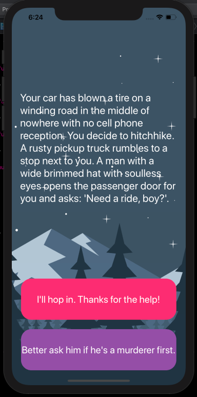

# Destini
A "choose your own adventure game" built for iOS. The app will tell a story depending on what the user chooses and can be fleshed out and modified to provide an engaging story-telling experience.

## Screenshots

## To Run
- Clone repo using Xcode Source Control
- Run app on preferred simulator

## Requirement
- iOS 13.x
- Xcode 11.x
